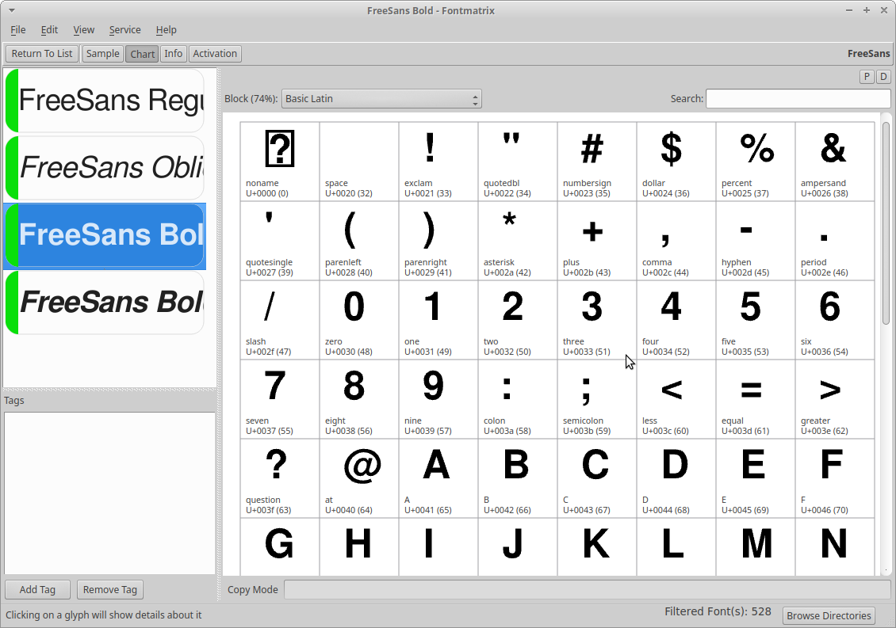

# Fontmatrix

Fontmatrix is a font management application for Linux, macOS, and Windows. 

It helps keeping your font collection in order, allowing you to enable and 
disable availability of fonts and font families in your system. This is typically
in demand by designers who tend to have huge collections of typefaces.

Searching for the right font in Fontmatrix is easy thanks to advanced support 
for [PANOSE](https://en.wikipedia.org/wiki/PANOSE) and user defined filters,
as well as tags.

Fontmatrix is also useful for type designers and enthusiasts, because it 
simplifies testing of OpenType features and allows comparing fonts glyph by 
glyph which is extremely useful for learning type design.

There is an extremely low-traffic mailing list available:

https://www.mail-archive.com/undertype-users@gna.org/maillist.html

The project was originally developed by Pierre Marchand between 2007 and 2011.
It is currently in maintenance mode and isn't worked on by any actual programmer.

Windows and macOS builds require new contributors. Flatpak build is
[available on Flathub](https://flathub.org/apps/details/com.github.fontmatrix.Fontmatrix), 
AppImage build could be created by interested contributors.
